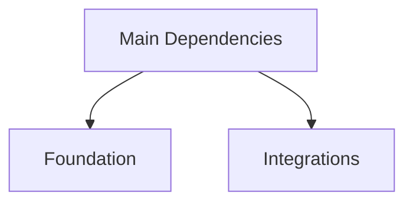

# Dependencies Doc Template

## Overview

Use this template for one top-level dependency justification doc.

## When To Use

Use this template when a project needs a short document that explains why its
main shipped dependencies exist.

Use this doc when the goal is justification and grouping, not lockfile detail
or packaging policy history.

## File Shape

1. frontmatter
2. title
3. `Overview`
4. diagram question and one diagram when useful
5. one core section such as `Dependency Roles` or `Dependency Groups`
6. `Rules`

## Rules

- Focus on the main shipped dependencies, not the full transitive graph.
- Explain what each dependency supports in the shipped runtime.
- Group dependencies by role rather than listing them as an undifferentiated
  inventory.
- If a dependency lacks a current justification, say so directly instead of
  inventing one.
- Keep the doc stable at the role and rationale level rather than tying it to
  individual call sites unless the detail is necessary.

## Template

```md
---
name: dependencies
doc_type: architecture
description: Justification for the main runtime dependencies declared by <product>. Use when you need to understand what each shipped dependency supports and how the dependency set is grouped.
---

# Dependencies

## Overview

This document describes what the shipped dependency set supports and how the
main dependency groups differ.

Question this diagram answers: <one concrete dependency question>




## Dependency Roles

### <Group>

Short paragraph.

| Package | Why it is shipped | Status |
| --- | --- | --- |
| `...` | ... | ... |

## Rules

- ...
- ...
- ...
```
