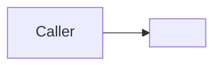

# Usage Doc Template

## Overview

Use this template for caller-facing usage docs.

## When To Use

Use this template when one doc should explain common public entry shapes,
caller workflows, and representative examples.

## File Shape

1. frontmatter
2. title
3. `Overview`
4. diagram question and one diagram when useful
5. optional `Shared Example Inputs` or `Shapes`
6. `Examples`

## Rules

- Keep the emphasis on caller workflows and public API shapes.
- Prefer representative examples over exhaustive scenario catalogs.
- Explain when to use an example, not only what code to copy.
- Keep this separate from verification and architecture theory.

## Template

```md
---
name: usage
doc_type: usage
description: Representative public usage patterns for application code. Use when you need examples of common caller workflows.
---

# Usage

## Overview

This document shows what this usage doc is for.

Question this diagram answers: <one concrete usage question>




## Shapes

- `<entry-shape-a>`
  One-line meaning.
- `<entry-shape-b>`
  One-line meaning.

## Examples

## 1. Pattern: <Example Title>

Use when:
The caller ...

```python
# representative example
```
```
