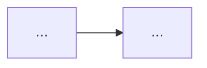

# Focused Architecture Doc Template

## Overview

Use this template for one focused architecture doc.

## When To Use

Use this template when one doc should explain one focused architecture concern
such as one concept or one flow.

## File Shape

1. frontmatter
2. title
3. `Overview`
4. diagram question and one diagram
5. one approved core section:
   `Main Model` for concept docs or `Main Flow` for flow docs
6. `Rules`

## Rules

- If the slice needs multiple internal groupings, use `###` subsections inside
  the chosen core section.
- In concept docs, prefer named `###` slices inside `Main Model` instead of a
  bare bullet list or numbered step list.

## Template

```md
---
name: <slice-id>
doc_type: architecture
description: High-level explanation of <slice concern>. Use when you need the <slice concern> model.
---

# <Slice Title>

## Overview

This document describes the concern this slice owns.

Question this diagram answers: <one concrete slice question>




## Main Model

### <Slice One>

- ...
- ...

### <Slice Two>

- ...
- ...

## Rules

- ...
- ...
- ...
```
