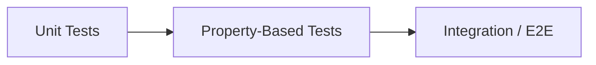

# Property-Based Testing Doc Template

## Overview

Use this template for one top-level property-based testing strategy doc.

## When To Use

Use this template when a project needs a high-level explanation of what
generated invariant checks should protect and why that layer exists.

Use this doc when the goal is generated invariant coverage and input scope, not
framework mechanics or strategy-by-strategy implementation detail.

## File Shape

1. frontmatter
2. title
3. `Overview`
4. diagram question and one diagram when useful
5. `Testing Role`
6. `Target Areas`
7. `Rules`

## Rules

- Keep the doc focused on generated checks for stable invariants.
- Emphasize broad input variation over deterministic semantics.
- If the project separates public-contract and internal property tests, state
  that split explicitly and keep the two groups close together under one
  `property_based/` layer.
- State explicitly that public-contract property tests should import only from
  the supported public API, never from `_internal` modules.
- Keep the layer distinct from named example tests, broader integration
  collaborations, replay-backed e2e, and live validation.
- Start the `Overview` with `This document describes ...`.
- Keep the `Overview` to one or two short paragraphs.
- Name each numbered area `## N. Area: <Title>`.
- Start each numbered area with one sentence beginning `This area should ...`
  before `### Good Targets`.
- Put stable layer boundaries in `Testing Role` or `Rules` instead of ending
  with a summary-style invariant section.

## Template

```md
---
name: property-based-testing
doc_type: verification
description: High-level walkthrough of what strong property-based testing should protect in <product>. Use when you need the invariant-driven verification layer for generated inputs and stable rules.
---

# Property-Based Testing

## Overview

This document describes the role of the property-based layer.

Question this diagram answers: <one concrete property-testing question>




## Testing Role

Short paragraph.

## Target Areas

## 1. Area: <Area>

This area should ...

### Good Targets

- ...
- ...

## Rules

- ...
- public-contract property tests import only from the supported public package
  boundary
- public-contract property tests do not import `_internal` modules
- internal property tests, when they exist, live in an explicit sibling group
  instead of mixing with public-contract files
- ...
- ...
```
