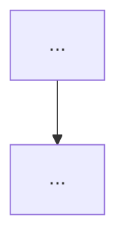
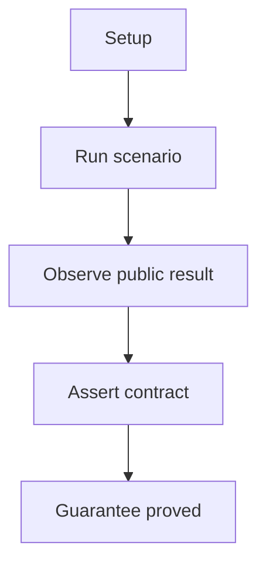

# Verification Doc Template

## Overview

Use this template for proof-oriented verification docs.

## When To Use

Use this template when one doc should explain what a verification set proves,
not how the system is implemented.

Use this template for one focused proof-area document as well as for broader
proof docs such as e2e or workbench overviews.

## File Shape

1. frontmatter
2. title
3. `Overview`
4. diagram question and one diagram when useful
5. one grouping section such as `Proof Areas`, `Areas`, or `Scenarios`

## Rules

- Keep the emphasis on what is proved at the public boundary.
- Use group headings that reflect proof areas.
- Link to tests or scripts only when they materially support the proof story.
- Start the `Overview` with `This document describes ...`.
- Keep the `Overview` to one or two short paragraphs.
- Name each numbered proof area `## N. Proof: <Title>`.
- Start each proof area with one sentence beginning
  `This proof area shows that ...` before `Seen In Tests` or `Seen In Scripts`.
- Use `### Seen In Tests` for test-backed proof and `### Seen In Scripts` for
  executable probes.
- Start each evidence description with `proves `.
- In proof docs with per-test or per-script evidence blocks, prefer one
  repeated mini-shape per evidence item:
  link line, one `proves ...` line, one diagram-question line, one diagram,
  then `Walkthrough:`, `Why this is sufficient:`, and `Would fail if:`
  lists, with optional `Trust assumptions:` or `Does not prove:` lists when the
  scope needs them.
- For proof-flow diagrams, prefer `flowchart TD` unless another Mermaid type is
  clearly more natural for the proof.
- Use one stable proof grammar inside proof-flow diagrams:
  `Setup`, `Run`, `Observe`, `Assert`, `Guarantee`.
- Keep diagram node text short and structural.
- Move detailed checks, exact branch conditions, counts, or payload facts into
  the `Walkthrough:` list under the diagram instead of overloading the nodes.
- Use `Walkthrough:` as a short numbered sequence that explains setup,
  execution, observed evidence, and public checks in the order they matter to
  the proof.
- Use `Why this is sufficient:` to explain why the observed evidence is enough
  to prove the guarantee without reading the source file.
- Use `Would fail if:` to name concrete implementation mistakes this evidence
  would catch.
- Keep `Trust assumptions:` and `Does not prove:` optional and narrow.
- Do not lose proof detail when simplifying the diagram; compress the diagram,
  not the evidence.
- Use `### Exceptions` only when the proof area needs provider or environment
  caveats.

## Template

```md
---
name: <verification-id>
doc_type: verification
description: High-level walkthrough of what the <verification set> proves. Use when you need the <verification set> verification story.
---

# <Verification Title>

## Overview

This document describes what this verification doc proves.

Question this diagram answers: <one concrete verification question>




## <Proof Areas>

## 1. Proof: <Title>

This proof area shows that ...

### Seen In Tests

[test_example.py](...)
proves one focused public guarantee.

Question this diagram answers: <one concrete proof question for this file>



Walkthrough:

1. <preserve one important setup detail>
2. <preserve one important branch, payload, or trace detail>
3. <preserve one important final assertion>

Why this is sufficient:

- <explain why these observations are enough>
- <explain why this is not only a happy-path coincidence>

Would fail if:

- <name one concrete bug this would catch>
- <name another concrete bug this would catch>

Trust assumptions:

- Optional assumption about replay, scripted servers, or worker isolation.

Does not prove:

- Optional scope boundary.

### Exceptions

- Optional caveat.
```
