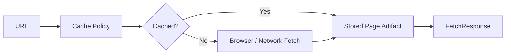

# Fetch Cache And Page Artifacts

## Overview

This document describes how `web_tools` retrieves page HTML from a URL while
making cache behavior explicit at the public boundary.

Question this diagram answers: How does a URL become a page artifact with
caller-visible cache evidence?

## Main Model

### Fetch Boundary

- `fetch_html(...)` accepts a URL and caller-visible cache controls such as
  force refresh and no-cache behavior.
- Fetching may use browser automation, crawler helpers, or transport adapters,
  but the caller receives a `FetchResponse`.
- The response owns the fetched HTML, final URL, cache evidence, and metadata in
  public vocabulary.

### Cache Evidence Boundary

- `configure_cache(...)` sets the page-artifact cache location through a public
  function instead of exposing storage internals.
- `FetchResponse.from_cache` distinguishes a fresh fetch from a cache hit.
- Cache behavior should be observable enough for callers and tests without
  requiring knowledge of cache keys or storage format.

### Replayable Artifact Boundary

- Page artifacts used by automated e2e tests must be committed or replayed
  hermetically.
- Live fetch investigation belongs in workbench or explicit recording flows,
  not default pytest behavior.
- A page artifact should be useful to downstream conversion and quoting without
  forcing those workflows to know whether the page was fetched or cached.

## Rules

- Fetching must return public `FetchResponse` results, not crawler or browser
  native responses.
- Cache hits and fresh fetches must remain distinguishable at the public
  boundary.
- Automated tests must fail rather than silently reaching external network
  dependencies.
