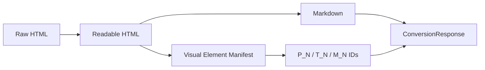

# HTML Conversion And Visual Manifest

## Overview

This document describes how `web_tools` converts raw HTML into caller-visible
HTML or Markdown while preserving a stable public manifest for visual page
elements.

Question this diagram answers: How does raw HTML become readable output with
visual IDs that other public workflows can use?

## Main Model

### Conversion Boundary

- `html2html(...)` and `html2md(...)` accept caller-provided HTML and optional
  base URL information in public vocabulary.
- Conversion may use private parsing and readability machinery, but callers
  receive library-owned output shapes rather than parser-native objects.
- The public contract is readable content plus stable metadata, not an exact
  snapshot of private parser steps.

### Visual Manifest Boundary

- `html2md(...)` returns a `ConversionResponse` that carries Markdown,
  metadata, and a `VisualElementManifest`.
- The manifest assigns public IDs to pictures, tables, and math elements using
  `P_N`, `T_N`, and `M_N` naming.
- The manifest lets callers reason about visual page evidence without reading
  raw HTML selectors or browser internals.

### Follow-On Workflow Boundary

- Visual element IDs are meaningful public handles for later element quoting.
- Markdown text and manifest entries are different evidence surfaces over the
  same source page, not unrelated conversion byproducts.
- Exact Markdown wording can vary with parser improvements, but element
  categories and public response structure should stay stable.

## Rules

- Conversion must return public `str` or `ConversionResponse` results, not raw
  parser or browser objects.
- Visual element IDs must stay in public vocabulary and remain suitable for
  `quote_element(...)`.
- Parser-specific mechanics should stay private unless they become a deliberate
  public contract.
