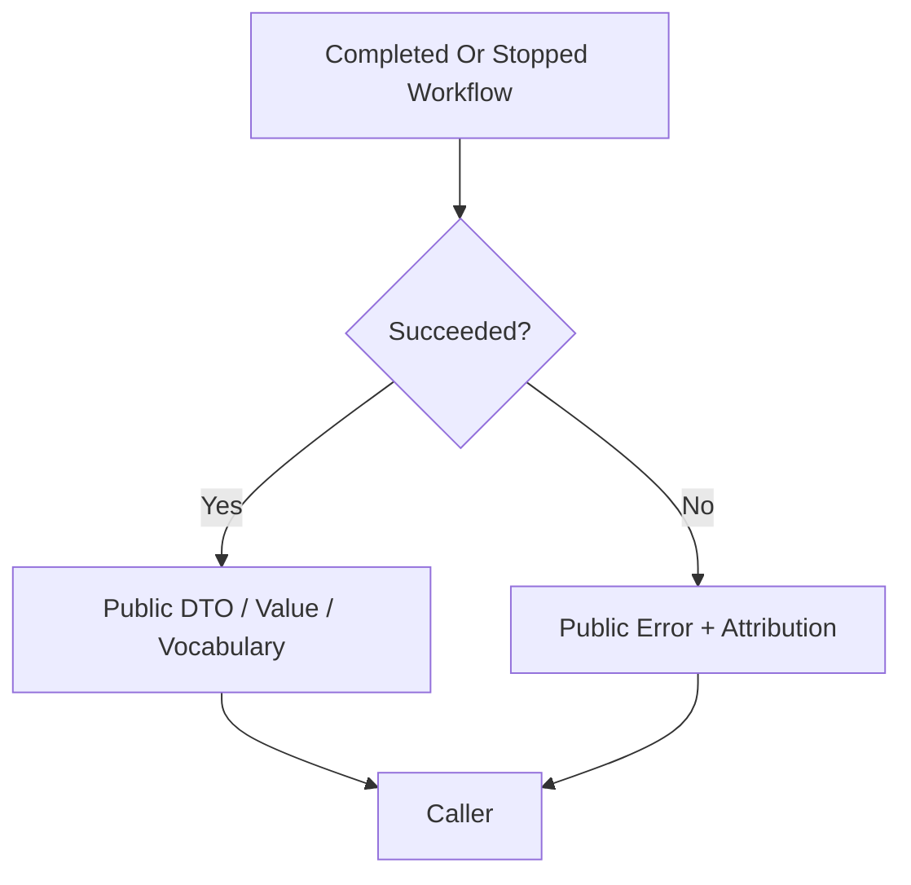

# Public Boundary And Errors

## Overview

This document describes what callers receive from `web_tools` at the terminal
public boundary: stable output shapes on success or library-owned errors on
runtime failure.

Question this diagram answers: What can leave the package boundary after one
public workflow succeeds or stops?

## Main Model

### Public Output Boundary

- HTML conversion returns `str` or `ConversionResponse`.
- Fetching returns `FetchResponse` with cache evidence.
- Quoting returns `QuoteMatch` or `VisualElementMatch` evidence.
- Media workflows return `MediaItem` values or empty collections when policy
  prevents downloads.

### Public Error Boundary

- Runtime failures should become `WebToolsError` subclasses rather than raw
  browser, crawler, cache, parser, or HTTP exceptions.
- Error types should preserve high-level attribution such as configuration,
  crawling, conversion, cache, quoting, media download, provider/runtime, or
  validation responsibility.
- Direct caller-contract mistakes may use built-in `TypeError` or `ValueError`
  when they are clearer than a package-specific runtime failure.

### Boundary Vocabulary

- Public enums such as `MediaType` and `VisualElementType` own stable category
  names.
- Public DTO fields should describe caller-visible facts rather than private
  implementation mechanics.
- Internal metadata may enrich a result, but it should not replace the main
  caller-facing artifact.

## Rules

- Raw browser pages, crawler responses, cache entries, parser objects, and HTTP
  clients must not cross the public boundary.
- Public errors should be small, named, and attributable.
- Callers should be able to understand success and failure without reading
  private runtime code.
