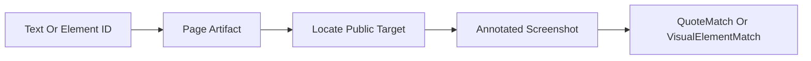

# Quote Text And Elements

## Overview

This document describes how `web_tools` turns caller-provided text fragments or
visual element IDs into public screenshot evidence.

Question this diagram answers: How do public quote inputs become annotated page
evidence without exposing browser internals?

## Main Model

### Text Quote Boundary

- `quote_text(...)` accepts public text and a URL, then returns a list of
  `QuoteMatch` results.
- Text matching may normalize whitespace, typography, math notation, or line
  breaks internally, but callers reason about their original text intent.
- Each match carries matched text, bounding boxes, and an annotated image as
  public evidence.

### Visual Element Quote Boundary

- `quote_element(...)` accepts a public manifest ID such as `P_0`, `T_1`, or
  `M_0`.
- The ID format ties element quoting back to the conversion manifest instead of
  forcing callers to provide CSS selectors or DOM paths.
- Missing elements can return `None`; invalid caller-supplied IDs are usage
  errors.

### Evidence Boundary

- Screenshots and bounding boxes are evidence outputs, not private browser
  handles.
- Tests should assert stable public facts such as found/not-found, image shape,
  element type, and positive bounding boxes instead of exact pixel coordinates.
- Text quote and element quote are two public views over the same page evidence
  model.

## Rules

- Callers should quote by public text or manifest ID, not by private selectors.
- Quoting must return public match objects and annotated images, not Playwright
  page objects.
- Matching tolerance may improve internally, but public success and failure
  semantics must stay explainable.
