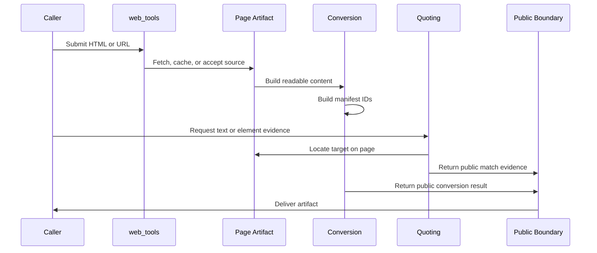

# Page Artifact Lifecycle

## Overview

This document describes the lifecycle of one page artifact from caller input to
public output or evidence.

Question this diagram answers: How does a page source move from caller input to
converted output, cache evidence, or quoted screenshots?

## Main Flow

1. The caller enters through the top-level package with HTML, a URL, text, a
   visual element ID, or a post-like media payload.
2. URL-based workflows resolve a page artifact through the fetch and cache
   model described in
   [../concepts/fetch-cache-and-page-artifacts.md](../concepts/fetch-cache-and-page-artifacts.md).
3. HTML conversion builds readable content and, when Markdown is requested, a
   visual manifest as described in
   [../concepts/html-conversion-and-visual-manifest.md](../concepts/html-conversion-and-visual-manifest.md).
4. Quoting workflows use caller-provided text or manifest IDs to locate and
   annotate page evidence, following
   [../concepts/quote-text-and-elements.md](../concepts/quote-text-and-elements.md).
5. Media workflows extract candidate URLs from post-like input and apply public
   download policy, following
   [../concepts/media-extraction-and-download-policy.md](../concepts/media-extraction-and-download-policy.md).
6. The workflow exits through public DTOs, public vocabulary, or public errors,
   following
   [../concepts/public-boundary-and-errors.md](../concepts/public-boundary-and-errors.md).

## Rules

- One page artifact may support multiple public outputs, but those outputs
  should preserve one coherent page-source story.
- Fetch, conversion, quote, and media workflows may share runtime support, but
  each public workflow must keep its own caller-facing contract.
- Private runtime state should not become a prerequisite for understanding the
  public artifact.
