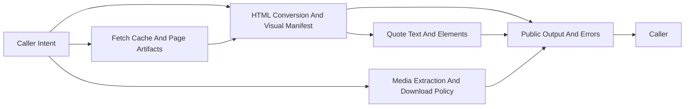

# System

## Overview

This document describes how `web_tools` turns page sources and post-like media
payloads into stable public artifacts: readable HTML, Markdown with a visual
manifest, fetched HTML with cache evidence, quoted screenshots, and media
items.

The package should preserve caller intent from public input to public artifact
without exposing browser automation, parser decisions, cache storage, or media
transport details.

Question this diagram answers: Which architectural slices cooperate to turn web
content into public artifacts without leaking private runtime mechanics?

## Public Runtime Model

Callers interact with one top-level `web_tools` import boundary rather than
private browser, cache, parser, or downloader modules. The public functions and
classes express four durable workflows: convert HTML, fetch page HTML, quote
page content, and extract or download media from post-like payloads. See
[../usage.md](../usage.md) for representative caller patterns.

HTML conversion is the central page-artifact slice. `html2html(...)` returns
readable sanitized HTML, and `html2md(...)` returns Markdown plus a
`VisualElementManifest` that assigns stable public IDs for pictures, tables,
and math elements. Those IDs connect conversion output to later element
quoting. See
[concepts/html-conversion-and-visual-manifest.md](concepts/html-conversion-and-visual-manifest.md)
for details.

Fetching and quoting are related but separate public workflows. `fetch_html(...)`
retrieves HTML and exposes cache evidence through `FetchResponse.from_cache`.
`quote_text(...)` and `quote_element(...)` return screenshot evidence for text
or manifest element IDs. See
[concepts/fetch-cache-and-page-artifacts.md](concepts/fetch-cache-and-page-artifacts.md)
and [concepts/quote-text-and-elements.md](concepts/quote-text-and-elements.md)
for details.

Media handling is a policy-driven workflow rather than a scraping free-for-all.
`MediaDownloader` receives public `MediaConfig`, extracts supported media URLs
from post-like payloads, applies limits, and returns `MediaItem` results or
empty results when policy disables download. See
[concepts/media-extraction-and-download-policy.md](concepts/media-extraction-and-download-policy.md)
for details.

## Execution Story

One page-artifact workflow should stay coherent from input to artifact. See
[flows/page-artifact-lifecycle.md](flows/page-artifact-lifecycle.md) for
details. The lifecycle may start from caller-provided HTML or from a URL, but
the terminal result should still be a public DTO, public vocabulary value, or
public exception.

The browser, cache, parser, and media runtime may change internally as long as
they preserve public meaning. Runtime failures are translated into
`WebToolsError` subclasses before crossing the package boundary, while direct
caller-contract violations may still use built-in `TypeError` or `ValueError`.
See [concepts/public-boundary-and-errors.md](concepts/public-boundary-and-errors.md)
for terminal-boundary details.

## Runtime Shape

Behind the public runtime model, the package should stay organized around a few
stable design groups.

- Public facades keep supported function signatures and constructor shapes
  visible.
- Public contracts define the artifacts callers receive from conversion,
  fetching, quoting, and media workflows.
- Public vocabulary defines stable category names for media and visual element
  types.
- Public config validates caller input before private runtime behavior is
  derived.
- Private runtime code owns browser orchestration, cache mechanics, HTML
  conversion, quoting, media routing, and transport details.
- Shared support helpers provide cross-cutting logging, formatting, config
  loading, and test support without becoming a second public API.

Those groups are not file-layout documentation. They are the runtime seams that
let one public package support page conversion, cache-aware fetching, visual
evidence, and media extraction without splitting into unrelated tools.
