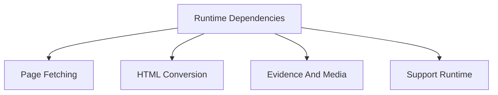

# Dependencies

## Overview

This document describes what the shipped dependency set supports and how the
main dependency groups differ. It focuses on dependency roles rather than the
full lockfile graph.

Question this diagram answers: Which product slices do the main shipped
dependencies support?

## Dependency Roles

### Page Fetching

These packages support retrieving dynamic or static page HTML before conversion
or quoting.

| Package          | Why it is shipped                                              | Status       |
| ---------------- | -------------------------------------------------------------- | ------------ |
| `crawl4ai`       | crawls pages for fetch workflows                               | core runtime |
| `playwright`     | drives browser-backed page evidence and dynamic content        | core runtime |
| `fake-useragent` | supplies realistic user-agent values for live page access      | edge runtime |
| `httpx`          | performs HTTP transport for media and supporting network paths | core runtime |

### HTML Conversion

These packages support turning raw page HTML into readable public artifacts.

| Package            | Why it is shipped                               | Status       |
| ------------------ | ----------------------------------------------- | ------------ |
| `readability-lxml` | extracts readable page content from full HTML   | core runtime |
| `lxml`             | parses and transforms HTML trees                | core runtime |
| `lxml-html-clean`  | supports safe HTML cleaning with `lxml`         | core runtime |
| `html2text`        | converts readable HTML into Markdown            | core runtime |
| `markdown`         | supports Markdown and HTML representation seams | core runtime |

### Evidence And Media

These packages support screenshot outputs, media bytes, and media policy.

| Package  | Why it is shipped                                             | Status       |
| -------- | ------------------------------------------------------------- | ------------ |
| `pillow` | represents annotated screenshot images at the public boundary | core runtime |

### Support Runtime

These packages support cross-cutting operational behavior.

| Package                 | Why it is shipped                                                         | Status                    |
| ----------------------- | ------------------------------------------------------------------------- | ------------------------- |
| `py-lib-runtime[cache]` | provides shared previews, logging mechanics, and persistent cache helpers | Direct runtime dependency |
| `tenacity`              | supports bounded retry behavior around unstable external calls            | Direct runtime dependency |

## Rules

- Keep this doc limited to direct runtime dependencies.
- Dependency docs should explain role and boundary, not every call site.
- If a dependency no longer supports a current slice, remove it or mark the
  gap before adding new runtime code around it.
