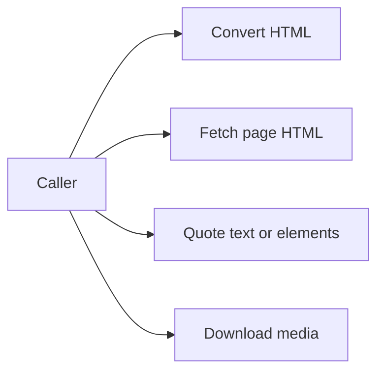

# Usage

## Overview

This document shows the main caller workflows exposed by the top-level
`web_tools` package. Examples use only supported public imports.

Question this diagram answers: which public entrypoint should a caller choose?



## Shapes

- `html2html(html)` returns readable sanitized HTML.
- `html2md(html)` returns Markdown plus a visual element manifest.
- `fetch_html(url)` returns fetched HTML and cache evidence.
- `quote_text(text, url)` returns text-match screenshot evidence.
- `quote_element(element_id, url)` returns one visual-element screenshot match.
- `MediaDownloader(config)` downloads eligible media URLs from post-like data.

## Examples

## 1. Pattern: Convert HTML To Markdown

Use when:
The caller already has HTML and needs Markdown plus a public manifest of
pictures, tables, and math elements.

```python
from web_tools import VisualElementType, html2md

response = html2md("<article><h1>Hello</h1><p>World</p></article>")
print(response.markdown)
print(response.manifest.counts)

for element in response.manifest.elements:
    if element.element_type == VisualElementType.PICTURE:
        print(element.id, element.src)
```

## 2. Pattern: Fetch HTML With Cache Evidence

Use when:
The caller needs page HTML and wants explicit evidence about whether a cached
artifact was used.

```python
from web_tools import configure_cache, fetch_html

configure_cache("~/.cache/web_tools")
response = await fetch_html("https://example.com")

print(response.url)
print(response.from_cache)
print(response.html)
```

## 3. Pattern: Quote Page Content

Use when:
The caller needs screenshot evidence that a text fragment or visual element was
found on a page.

```python
from web_tools import quote_element, quote_text

text_matches = await quote_text("example phrase", "https://example.com")
for match in text_matches:
    print(match.text, len(match.boxes), match.image.size)

element_match = await quote_element("T_0", "https://example.com")
if element_match is not None:
    print(element_match.id, element_match.element_type, element_match.bbox)
```

## 4. Pattern: Download Media From A Post Payload

Use when:
The caller has post-like data with media URLs and wants config-gated downloads.

```python
from web_tools import MediaConfig, MediaDownloader, MediaType

config = MediaConfig(enabled=True, allowed_types=[MediaType.IMAGE])
post = {"url": "https://i.redd.it/example.jpg"}

with MediaDownloader(config=config, cache_dir="~/.cache/web_tools/media") as media:
    urls = media.extract_media_urls(post)
    items = media.download_from_post(post)

print(urls)
print(len(items))
```
