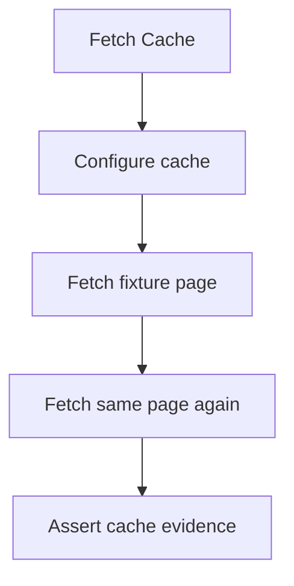
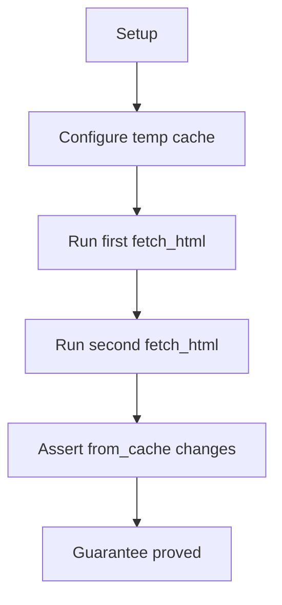
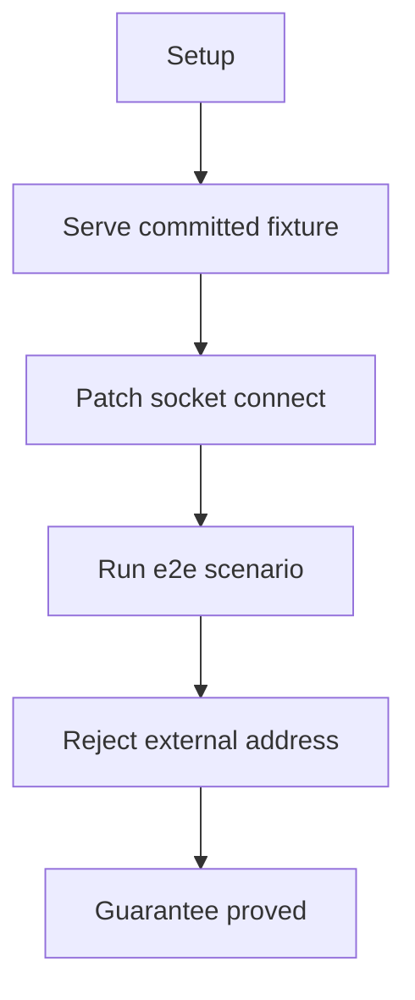

# Fetch Cache And Page Artifacts

## Overview

This document describes how the fetch-cache e2e slice proves that URL fetches
produce public page artifacts with explicit cache evidence.

Question this diagram answers: Which public fetch and replay guarantees does
the fetch-cache slice prove?

## Proof Areas

## 1. Proof: Repeated Fetches Expose Cache Hits

This proof area shows that configured page caching affects public fetch behavior
and is visible through `FetchResponse.from_cache`.

### Seen In Tests

[test_cache_behavior.py](../../../../tests/web_tools/e2e/fetch_cache_and_page_artifacts/test_cache_behavior.py):
proves the first fetch is fresh and the second fetch of the same loopback page
uses cache.

Question this diagram answers: How does this file prove public cache evidence?

Walkthrough:

1. creates an isolated temporary cache directory
2. configures cache through the public `configure_cache(...)` facade
3. fetches the committed loopback page twice through `fetch_html(...)`
4. asserts the first response is not from cache and the second response is from
   cache

Why this is sufficient:

- the proof checks the caller-visible cache signal instead of private cache
  files
- the fixture URL is loopback-only, so the scenario proves cache behavior
  without internet dependency

Would fail if:

- cache configuration stopped reaching fetch execution
- `FetchResponse.from_cache` stopped reflecting cache hits
- e2e fetch tests silently reached external network instead of committed replay

## 2. Proof: E2E Page Artifacts Stay Hermetic

This proof area shows that default e2e runs use committed page artifacts and
block accidental external network access from pytest-side calls.

### Seen In Tests

[conftest.py](../../../../tests/web_tools/e2e/conftest.py):
proves e2e page scenarios run against a loopback fixture server and reject
non-loopback socket connections.

Question this diagram answers: How does this fixture protect hermetic page
artifact replay?

Walkthrough:

1. starts a local HTTP server over `tests/web_tools/e2e/fixtures/site`
2. passes the loopback fixture URL into e2e tests
3. rejects non-loopback Python socket connections during e2e pytest execution
4. also requires committed VCR cassettes for tests marked with `pytest.mark.vcr`

Why this is sufficient:

- the default e2e path cannot quietly fetch live pages when fixture coverage is
  missing
- VCR-marked tests fail when replay data is missing unless recording is
  explicitly enabled

Would fail if:

- tests depended on external hosts during normal pytest runs
- a VCR test was added without committed replay data
