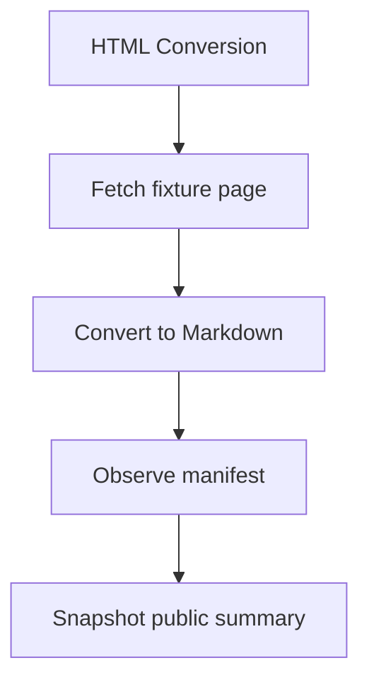
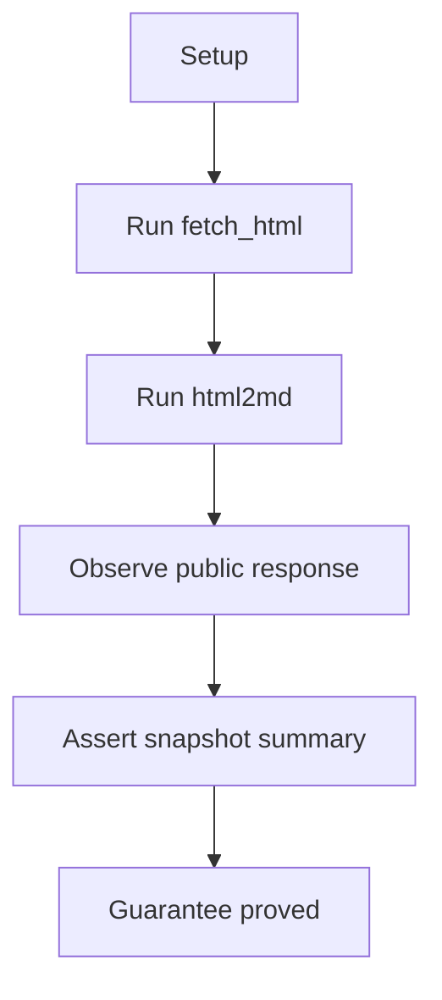

# HTML Conversion And Visual Manifest

## Overview

This document describes how the html-conversion e2e slice proves that fetched
page HTML can become Markdown with stable visual manifest evidence.

Question this diagram answers: Which public conversion guarantees does the
html-conversion slice prove?

## Proof Areas

## 1. Proof: HTML Becomes Markdown With Manifest Evidence

This proof area shows that a page artifact can be fetched through the public
API, converted through the public API, and summarized through public response
fields.

### Seen In Tests

[test_html2md_pipeline.py](../../../../tests/web_tools/e2e/html_conversion_and_visual_manifest/test_html2md_pipeline.py):
proves fetched page HTML can become `ConversionResponse` Markdown with a visual
element manifest.

Question this diagram answers: How does this file prove the public Markdown and
manifest contract?

Walkthrough:

1. serves committed page HTML through the shared loopback e2e fixture
2. calls `fetch_html(...)` and passes the returned HTML into `html2md(...)`
3. serializes public facts such as Markdown length, manifest counts, table IDs,
   total elements, and response metadata
4. compares the public summary to the committed snapshot

Why this is sufficient:

- the proof uses only public entrypoints and public response fields
- the snapshot avoids brittle full-Markdown comparison while preserving the
  manifest evidence that downstream quote workflows need

Would fail if:

- HTML fetching stopped returning usable page content
- Markdown conversion stopped producing nontrivial output
- visual elements stopped being categorized or ID'd in the public manifest
