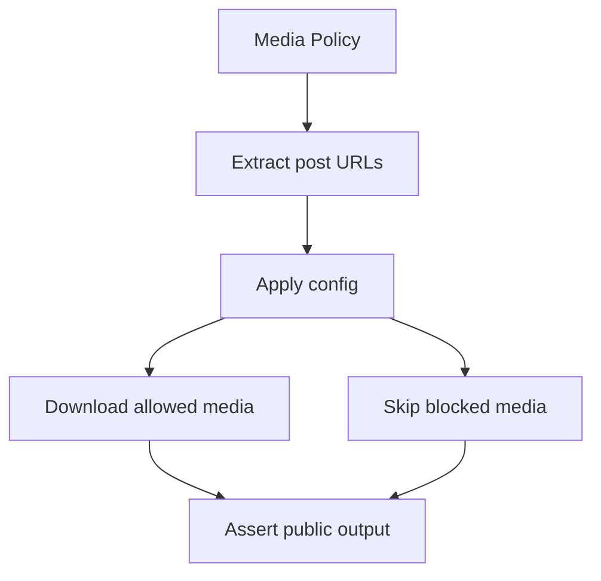
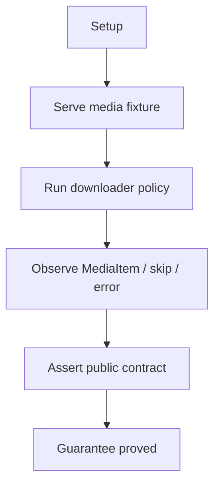

# Media Extraction And Download Policy

## Overview

This document describes how the media e2e slice proves that post-like media
inputs become public media results only when caller-visible policy allows them.

Question this diagram answers: Which public media guarantees does the media
policy slice prove?

## Proof Areas

## 1. Proof: Media Policy Controls Public Download Results

This proof area shows that public media config controls extraction, download,
cache evidence, skipped results, and media transport errors.

### Seen In Tests

[test_media_policy_pipeline.py](../../../../tests/web_tools/e2e/media_extraction_and_download_policy/test_media_policy_pipeline.py):
proves the public `MediaDownloader` handles disabled policy, enabled image
downloads, cache hits, type skips, total-limit skips, and transport failures
without exposing private downloader mechanics.

Question this diagram answers: How does this file prove public media policy
behavior?

Walkthrough:

1. serves committed media fixtures through the shared loopback e2e server
2. extracts post-like media URLs through `MediaDownloader.extract_media_urls`
3. verifies disabled policy returns no downloaded items while still exposing
   candidate URLs and stats
4. verifies enabled image policy returns one public `MediaItem`, then exposes a
   cache hit on repeat download
5. verifies disallowed GIF and zero-total policies skip downloads without
   requiring callers to know private routing details
6. verifies a missing loopback image URL raises public `MediaDownloadError`

Why this is sufficient:

- the proof uses top-level public imports and public DTO fields only
- the fixture server is loopback-only, so the e2e run does not require internet
  access
- the same scenario covers success, policy skip, cache evidence, stats, and
  public error translation

Would fail if:

- media extraction stopped reading supported post-like payload shapes
- disabled or limit-blocked policies performed downloads
- allowed image downloads stopped returning public `MediaItem` values
- media cache hits stopped crossing the public boundary as `from_cache=True`
- failed transport crossed the public boundary as a raw HTTP error or silent
  missing result

Does not prove:

- real external media host compatibility
- proxy-provider availability or performance
- visual validity of the downloaded image bytes
