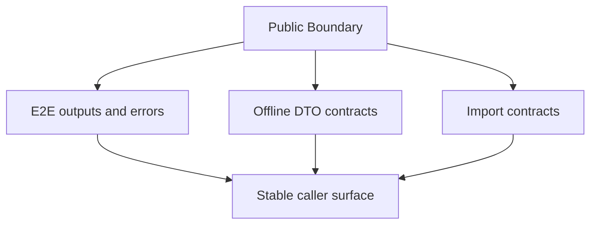
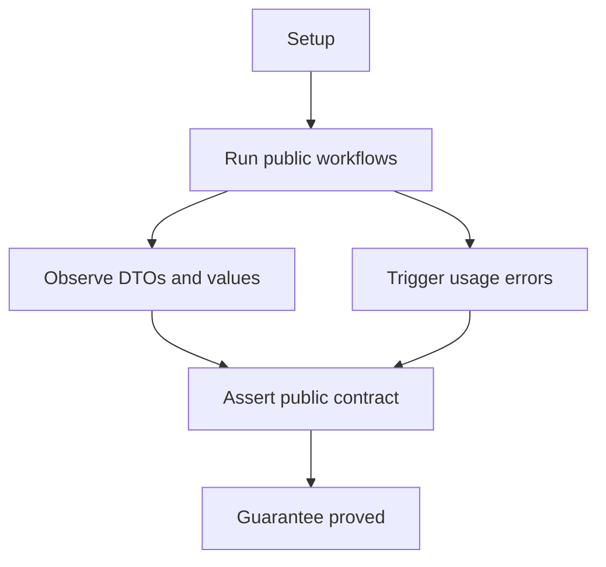
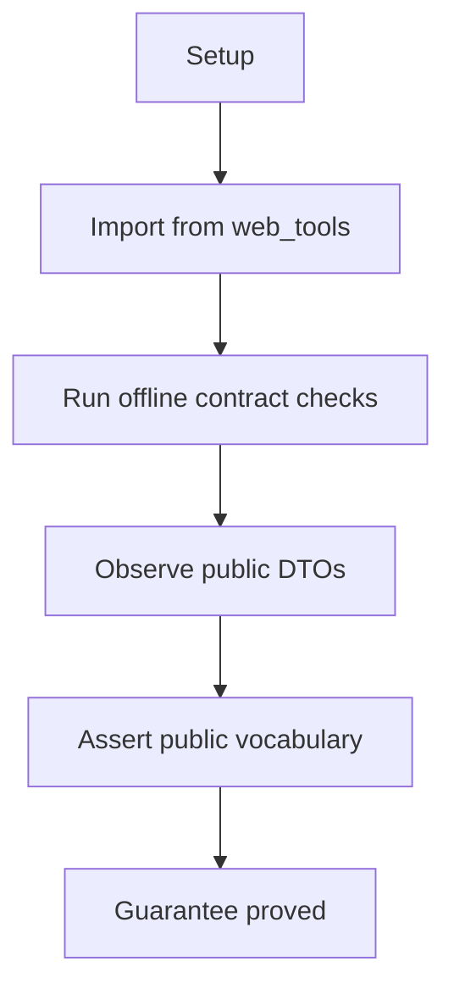
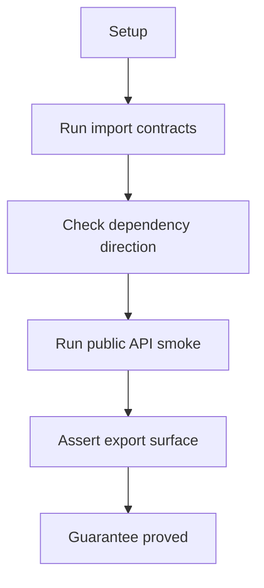

# Public Output And Errors

## Overview

This document describes how e2e, unit, smoke, and import checks prove that
public outputs, config objects, vocabulary, and boundary direction remain
stable.

Question this diagram answers: Which package-boundary guarantees are checked
outside and across the workflow-specific e2e slices?

## Proof Areas

## 1. Proof: E2E Outputs And Errors Stay Public

This proof area shows that representative completed workflows and stopped
workflows cross the package boundary as public DTOs, values, vocabulary, or
named public errors.

### Seen In Tests

[test_public_boundary_contracts.py](../../../../tests/web_tools/e2e/public_output_and_errors/test_public_boundary_contracts.py):
proves successful fetch, conversion, and disabled media workflows return public
values, and invalid config or element IDs raise public `WebToolsError`
subclasses.

Question this diagram answers: How does this file prove terminal boundary
behavior through e2e execution?

Walkthrough:

1. serves committed page fixtures through the shared loopback e2e server
2. calls `fetch_html`, `html2html`, and `html2md` through the top-level package
3. asserts `FetchResponse`, `str`, `ConversionResponse`,
   `VisualElementManifest`, and public enum vocabulary values
4. calls the public media facade with disabled policy and asserts empty output
   plus public stats
5. triggers invalid media config and invalid visual element ID inputs
6. asserts the stopped workflows raise attributable `WebToolsError` subclasses

Why this is sufficient:

- the proof checks what a caller receives at the final package boundary
- the scenario avoids raw browser, parser, cache, and HTTP-client assertions
- success and failure shapes are both covered in one boundary-focused e2e slice

Would fail if:

- public workflows leaked private objects instead of public DTOs or values
- media disabled-policy output required transport details to interpret
- invalid caller input crossed as raw implementation exceptions
- public enum vocabulary drifted away from documented category names

## 2. Proof: Public DTOs And Vocabulary Stay Usable Offline

This proof area shows that top-level public imports expose the documented
contracts without requiring live browser, cache, or network dependencies.

### Seen In Tests

[test_public_html_contract.py](../../../../tests/web_tools/unit/test_public_html_contract.py):
proves HTML conversion returns readable content, `ConversionResponse`, and
`VisualElementType` manifest values.

[test_public_config_contract.py](../../../../tests/web_tools/unit/test_public_config_contract.py):
proves public config accepts public `MediaType` vocabulary, normalizes allowed
types, and rejects invalid values through package errors.

[test_public_media_contract.py](../../../../tests/web_tools/unit/test_public_media_contract.py):
proves the public media facade exposes config, extraction, disabled-download,
and stats behavior without live network work.

Question this diagram answers: How do these files prove the offline public
contract layer?

Walkthrough:

1. imports only from the top-level `web_tools` package
2. exercises representative conversion, config, and media behavior without
   internet access
3. asserts public response classes, enum values, normalized config snapshots,
   and disabled-media results

Why this is sufficient:

- the proof protects caller-visible contracts independently from browser-heavy
  e2e scenarios
- invalid config checks prove public errors are part of the boundary contract

Would fail if:

- public exports drifted away from documented DTOs or vocabulary
- config validation accepted unsupported media types
- media behavior required live transport for disabled-policy cases

## 3. Proof: Import Direction Keeps Internals Private

This proof area shows that public, private, support, tests, and workbench code
keep the intended dependency direction.

### Seen In Tests

`uv run lint-imports --config pyproject.toml`
proves facade modules import private runtime code only through approved
boundaries and public-contract tests do not import private internals.

`uv run py-lib-smoke-public-api`
proves the top-level public export list is present, unique, and internally
consistent.

Question this diagram answers: How do import checks prove the public boundary
is not only documented?

Walkthrough:

1. checks import-layer contracts declared in project configuration
2. rejects tests that reach into private internals for public-contract proof
3. validates that `web_tools.__all__` remains coherent

Why this is sufficient:

- boundary direction is enforced mechanically instead of relying on docs alone
- public API smoke catches accidental export removals or duplicate names

Would fail if:

- workbench or tests started treating private modules as supported API
- public facade imports drifted outside approved private runtime seams
- top-level exports no longer matched the public surface
