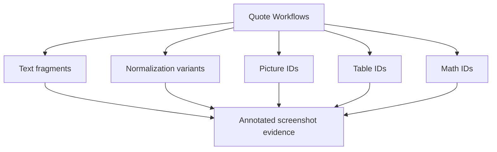
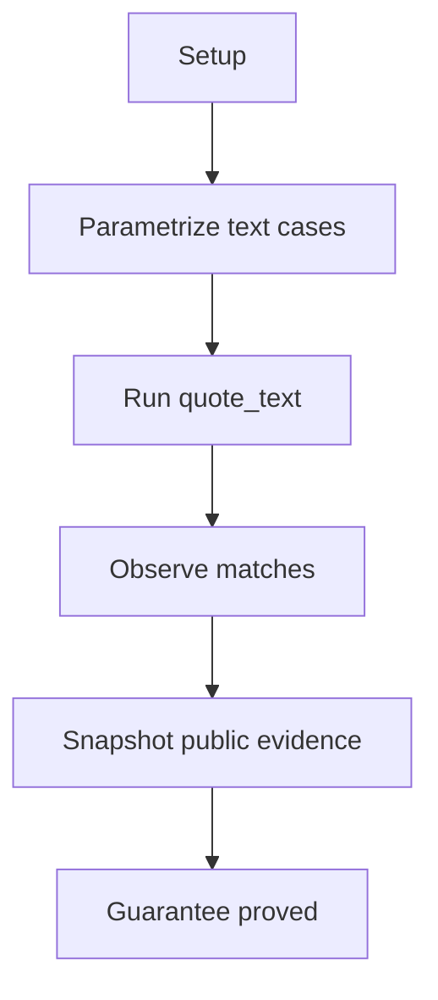
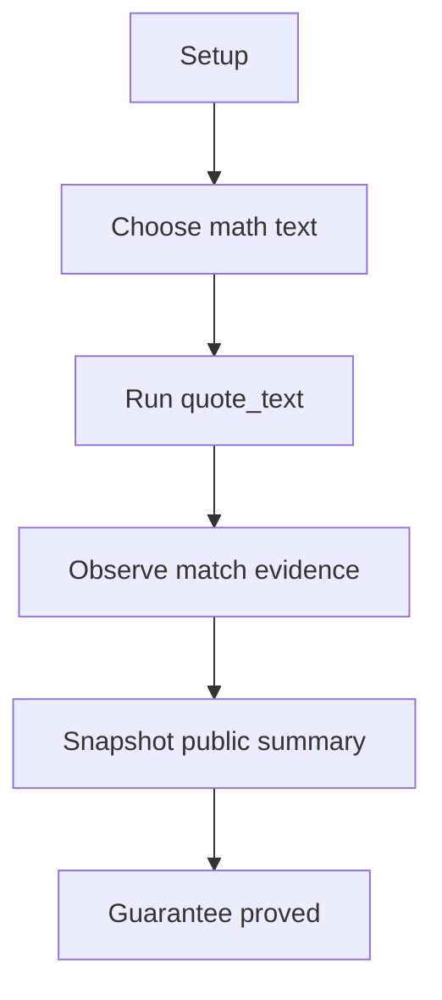
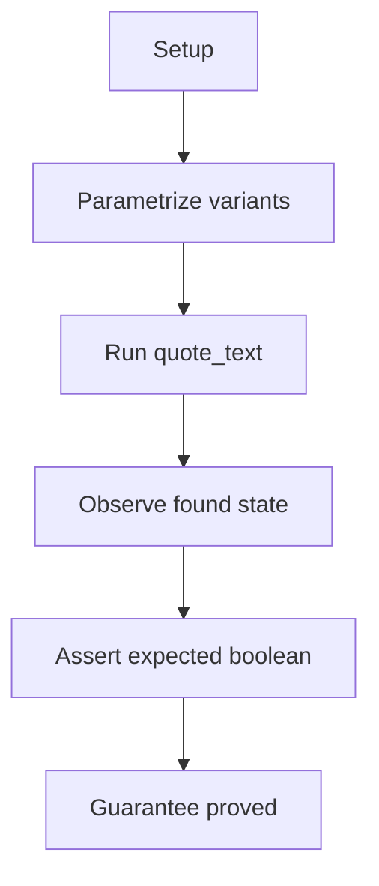
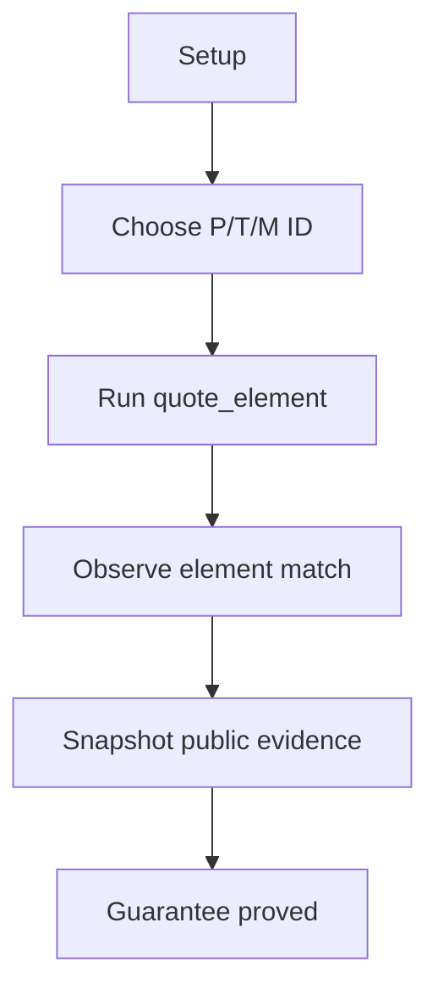

# Quote Text And Elements

## Overview

This document describes how the quote-text and quote-element e2e slices prove
that public quote inputs become annotated screenshot evidence.

Question this diagram answers: Which public quote workflows are proved by the
e2e suite?

## Proof Areas

## 1. Proof: Text Quotes Return Public Match Evidence

This proof area shows that caller-provided text can be found on a page and
returned as public `QuoteMatch` evidence.

### Seen In Tests

[test_quote_text_edge_cases.py](../../../../tests/web_tools/e2e/quote_text_and_elements/test_quote_text_edge_cases.py):
proves standard text, formatted text, multi-line text, citation-adjacent text,
short unique phrases, and list-item text can be quoted.

Question this diagram answers: How does this file prove robust text quote
evidence?

Walkthrough:

1. serves the committed page fixture through the loopback e2e URL
2. runs `quote_text(...)` for several public text shapes
3. serializes match count, matched text, box count, image size, and image mode
4. compares each public evidence summary to a committed snapshot

Why this is sufficient:

- the proof checks real quote outputs rather than internal matching helpers
- the cases cover text shapes that commonly break browser-to-Markdown matching

Would fail if:

- text matching lost formatting, line-break, citation, or list-item tolerance
- screenshot evidence stopped carrying boxes or images

[test_quote_math_text_pipeline.py](../../../../tests/web_tools/e2e/quote_text_and_elements/test_quote_math_text_pipeline.py):
proves Markdown-rendered math text can be quoted through the same public text
entrypoint.

Question this diagram answers: How does this file prove math text quote
behavior through the public API?

Walkthrough:

1. chooses a Markdown-style math text fragment from the page
2. calls `quote_text(...)` through the public package boundary
3. serializes found status, match count, text, box count, image size, and image
   mode

Why this is sufficient:

- math text uses normalization-sensitive page content rather than a trivial
  plain paragraph
- the public evidence summary proves the same `QuoteMatch` contract applies

Would fail if:

- math text normalization stopped matching rendered page text
- quote results omitted screenshot evidence

## 2. Proof: Text Normalization Keeps Expected Boundaries

This proof area shows that expected copy/paste variants can match while an
ambiguous bare fraction stays rejected.

### Seen In Tests

[test_quote_text_normalization_cases.py](../../../../tests/web_tools/e2e/quote_text_and_elements/test_quote_text_normalization_cases.py):
proves selected normalization variants have explicit expected found or
not-found behavior.

Question this diagram answers: How does this file prove normalization is useful
without becoming too broad?

Walkthrough:

1. checks missing-space, hyphen/endash, exponent, multiplication, and fraction
   variants
2. runs every case through `quote_text(...)`
3. asserts only the expected cases produce matches

Why this is sufficient:

- the proof covers both positive and negative normalization behavior
- the negative case prevents normalization from claiming overly ambiguous text

Would fail if:

- common copied text variants stopped matching
- matching became too permissive and accepted ambiguous short text

## 3. Proof: Visual Element IDs Return Element Evidence

This proof area shows that public visual element IDs can be quoted as annotated
screenshot evidence.

### Seen In Tests

[test_quote_picture_pipeline.py](../../../../tests/web_tools/e2e/quote_text_and_elements/test_quote_picture_pipeline.py):
proves a picture ID returns `VisualElementMatch` evidence.

[test_quote_table_pipeline.py](../../../../tests/web_tools/e2e/quote_text_and_elements/test_quote_table_pipeline.py):
proves a table ID returns `VisualElementMatch` evidence.

[test_quote_math_element_pipeline.py](../../../../tests/web_tools/e2e/quote_text_and_elements/test_quote_math_element_pipeline.py):
proves a math element ID returns `VisualElementMatch` evidence.

Question this diagram answers: How do these files prove public visual element
quoting across element categories?

Walkthrough:

1. each test chooses one public manifest-style ID from a committed page fixture
2. calls `quote_element(...)` through the public package boundary
3. serializes found state, element ID, element type, bounding-box keys,
   positive size, image size, and image mode
4. compares public evidence summaries to committed snapshots

Why this is sufficient:

- the proof covers all public visual element categories
- exact coordinates are intentionally avoided while positive geometry and image
  evidence remain required

Would fail if:

- manifest-style IDs stopped resolving to page elements
- element categories were misclassified
- screenshot evidence or bounding-box structure disappeared
