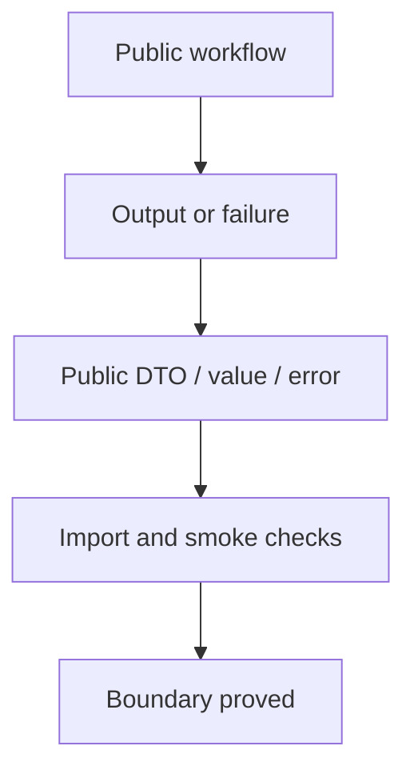
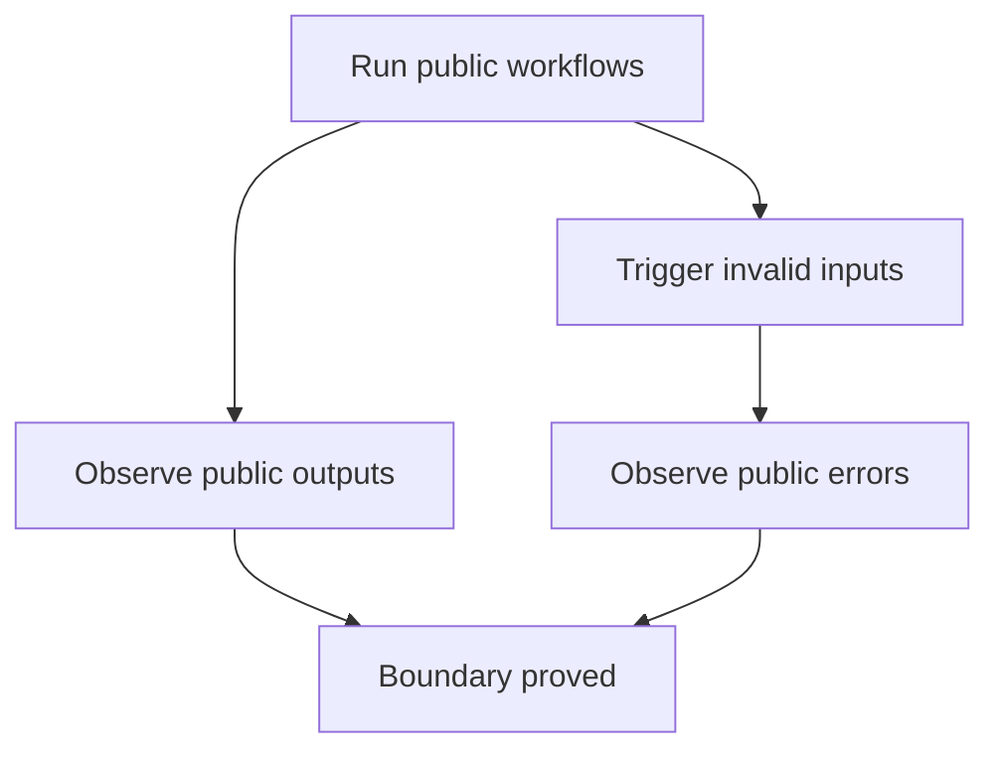

# Public Boundary And Errors Verification

## Overview

This document describes how `web_tools` proves that public workflows return
public DTOs, values, vocabulary, and errors without leaking private browser,
parser, cache, or transport objects.

Question this diagram answers: Which checks catch boundary drift before it
reaches callers?

## 1. Proof: Public Outputs And Errors Stay Stable

This proof area shows that representative completed and stopped workflows cross
the package boundary as public values or named public errors.

### Seen In Tests

[test_public_boundary_contracts.py](../../../tests/web_tools/e2e/public_output_and_errors/test_public_boundary_contracts.py)
proves successful fetch, conversion, and disabled-media workflows return public
values, while invalid media config and element IDs raise public
`WebToolsError` subclasses.

Question this diagram answers: How does e2e execution prove terminal boundary
behavior?

Walkthrough:

1. The tests serve committed fixtures through a loopback e2e server.
2. They call public functions and classes through the top-level package.
3. They assert public DTOs, values, vocabulary, and error types.

Why this is sufficient:

- The proof checks what a caller receives after representative workflows.
- The assertions avoid depending on private implementation objects.

Would fail if:

- Workflows leaked private browser, parser, cache, or HTTP objects.
- Invalid caller input stopped raising attributable public errors.

## 2. Proof: Public API Direction Stays Enforced

This proof area shows that package boundaries are enforced mechanically.

### Seen In Tests

`uv run lint-imports --config pyproject.toml`
proves facade modules use approved private-core boundaries and public-contract
tests do not import private internals.

`uv run py-lib-smoke-public-api`
proves the top-level public export list is present, unique, and coherent.

Why this is sufficient:

- Import contracts catch accidental dependency direction drift.
- Public API smoke catches accidental export removals or duplicate names.

Would fail if:

- Public-contract tests started proving behavior through private modules.
- The top-level package stopped exposing a coherent public surface.
