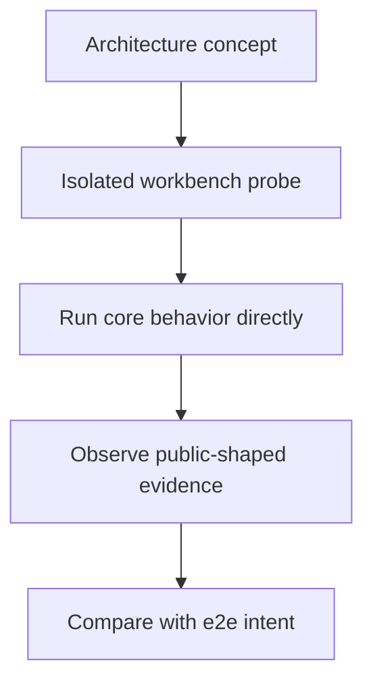

# Workbench Overview

## Overview

This document describes the isolated manual probes that mirror the
`web_tools` architecture concepts without importing the shipped package.

Question this diagram answers: What role does the workbench surface play beside
hermetic e2e tests?



## Proof Areas

## 1. Proof: Fetch Cache And Page Artifacts

[fetch_cache_and_page_artifacts.py](../../../workbench/web_tools/fetch_cache_and_page_artifacts.py):
proves page retrieval, cache hits, force refresh, and no-cache behavior through
an isolated cache policy over a live HTTP page.

Why this is sufficient:

- the probe makes fresh and cached page artifacts visible without exposing
  cache keys or storage layout
- the page artifact comes from real HTTP retrieval through `httpx`
- the script stays independent from shipped fetch code while preserving the
  caller-visible cache evidence model

## 2. Proof: HTML Conversion And Visual Manifest

[html_conversion_and_visual_manifest.py](../../../workbench/web_tools/html_conversion_and_visual_manifest.py):
proves live HTML retrieval, readability extraction, Markdown conversion, and
stable visual IDs over a real table-heavy page.

Why this is sufficient:

- the probe exercises live HTTP plus raw conversion dependencies directly
- the manifest output is serialized as public IDs and counts, not parser-native
  objects

## 3. Proof: Quote Text And Elements

[quote_text_and_elements.py](../../../workbench/web_tools/quote_text_and_elements.py):
proves text quoting and visual-element quoting through direct Playwright
browser evidence on a live page over public-style `P_N`, `T_N`, and `M_N` IDs.

Why this is sufficient:

- the probe returns bounding boxes and image metadata instead of browser
  handles
- the script isolates the browser evidence concept without depending on package
  quoting internals

## 4. Proof: Media Extraction And Download Policy

[media_extraction_and_download_policy.py](../../../workbench/web_tools/media_extraction_and_download_policy.py):
proves live page media extraction, disabled policy, allowed image download,
cache hits, and total-limit skips.

Why this is sufficient:

- the probe uses real HTML from `python.org` and downloads real image bytes
- result values expose media item facts, cache evidence, and skip outcomes
  without caller knowledge of private transport mechanics

## Manual Commands

Run one probe directly:

```bash
direnv exec . uv run python -m workbench.web_tools.fetch_cache_and_page_artifacts
```

Reproduce the same probe inside an already-running event loop:

```bash
direnv exec . uv run py-lib-reproduce-running-loop \
    workbench.web_tools.quote_text_and_elements
```

## Boundaries

These probes do not prove shipped public API behavior. The e2e tests own that
contract. Workbench scripts are manual executable documentation for isolated
feature behavior and dependency questions.

Would fail if:

- workbench probes had to import `web_tools` or `src` to inspect core behavior
- manual concept proof required default pytest or CI to reach live external
  network dependencies
